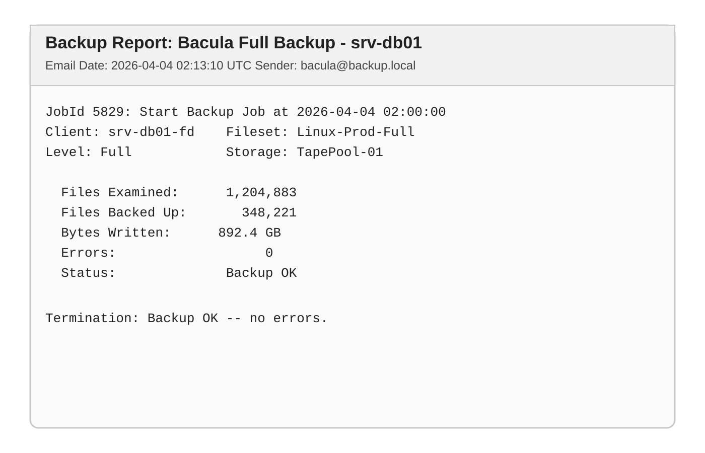

# 📂 Bacula Log Archiver — Google Apps Script

[](https://github.com/fernando-msa/bacula-log-archiver)

> Automates Bacula backup-log collection from Gmail, converts messages into styled PDF evidence, and organizes everything in Google Drive for audit-ready retention.

---

## 🇺🇸 English

### Overview

Bacula backup jobs usually send execution logs by email. Over time, these logs get buried in inboxes and become difficult to audit.

This script solves that by:

1. Reading emails from a dedicated Gmail label (for example: `Backup HAMA`)
2. Converting each message into a **styled PDF**
3. Preserving log readability with **monospaced formatting**
4. Organizing generated files into date-based folders in Google Drive
5. Archiving processed emails to keep inboxes clean

### Key Features

- Gmail label-based ingestion
- PDF conversion with custom HTML/CSS
- Monospaced body output for technical log readability
- Automatic date-folder structure (`yyyy-MM-dd`)
- Optional attachment export
- Archive + label removal to prevent reprocessing

### PDF Output (Monospaced Log Format)

The generated PDF includes:

- Backup report title
- Original email date
- Sender information
- Log body rendered in monospaced format (`Courier New`) with preserved spacing

**Reference screenshot (example layout):**



### Use Cases

- **Backup audit trail:** maintain immutable-style evidence of every Bacula job run.
- **Compliance support:** centralize logs for internal controls and external audits.
- **Operations handoff:** provide standardized daily evidence for NOC/SRE teams.
- **Incident response:** quickly search historical backup output by date.

### Retention & Governance Notes

- Define a formal retention window (for example, 90 days, 1 year, or policy-driven).
- Restrict destination-folder access by least privilege.
- Consider enabling Drive retention/records policies where available.
- Store script configuration and folder ownership under a service/admin account.
- If your policy requires stronger immutability, replicate PDFs into a WORM-capable archive tier.

### Stable Release

This repository is currently documented as **stable release `v1.0.0`** for production use in straightforward Bacula-via-Gmail workflows.

---

## 🇧🇷 Português

### Visão Geral

Scripts de backup como o **Bacula** enviam logs por e-mail após cada execução. Com o tempo, esses e-mails se acumulam na caixa de entrada e tornam a auditoria de backups trabalhosa.

Este script resolve isso automaticamente:

1. Lê os e-mails com um marcador específico no Gmail (ex.: `Backup HAMA`)
2. Converte cada e-mail em **PDF estilizado**
3. Mantém o corpo do log em **formatação monoespaçada**
4. Organiza os PDFs no Google Drive em **pastas por data**
5. Arquiva os e-mails processados, mantendo a caixa limpa

### Funcionalidades

- Leitura de e-mails por marcador do Gmail
- Conversão para PDF com CSS customizado
- Fonte monoespaçada para facilitar leitura técnica
- Organização automática em subpastas por data (`yyyy-MM-dd`)
- Suporte a anexos extras
- Arquivamento automático e remoção do marcador

### Casos de Uso

- **Auditoria de backup:** trilha de evidências por execução.
- **Conformidade:** documentação para controles internos e auditorias externas.
- **Operação:** repasse padronizado de evidências para times técnicos.
- **Resposta a incidentes:** consulta rápida de histórico por data.

### Observações de Retenção e Governança

- Defina política de retenção formal (ex.: 90 dias, 1 ano ou exigência regulatória).
- Limite o acesso à pasta destino com princípio de menor privilégio.
- Considere políticas de retenção/records no Google Drive quando disponíveis.
- Mantenha propriedade da automação em conta institucional.
- Para maior imutabilidade, replique os PDFs para camada de arquivamento adequada.

---

## ⚙️ Quick Setup

1. Open [script.google.com](https://script.google.com)
2. Create a new project
3. Paste `bacula-log-archiver.gs`
4. Update:

```javascript
var nomeMarcador = "Backup HAMA";
var pastaPaiId   = "SEU_ID_AQUI";
```

5. Authorize Gmail + Drive permissions
6. (Optional) Configure a daily trigger for `salvarLogsBaculaComoPDFEstilizado`

---

## ⚠️ Known Limitations

| Limitation | Detail |
|---|---|
| Duplicate generation on reruns | No built-in duplicate PDF check yet. |
| Fixed timezone | `GMT-3` is hardcoded by default. |
| Apps Script execution quota | Large email volumes may require batching. |

---

## 📜 License

Distributed under the MIT license. See `LICENSE` for details.
